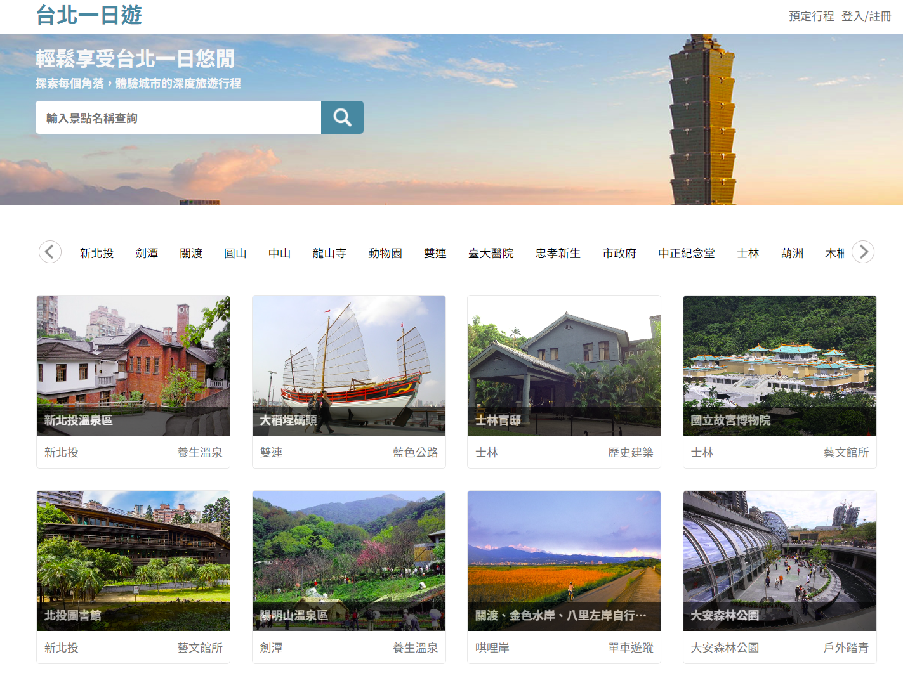
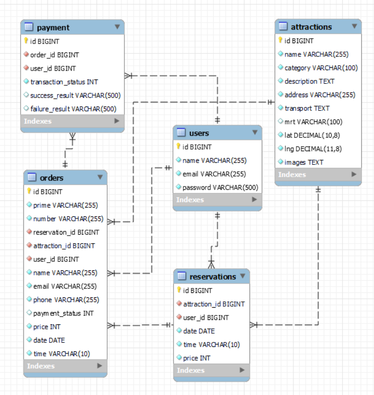
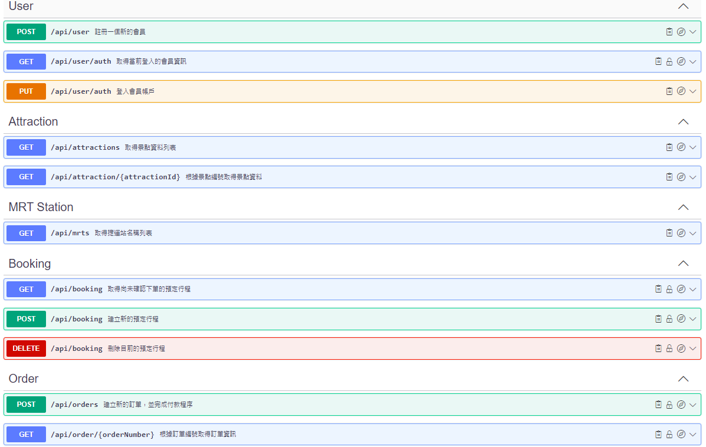

# Taipei Day Trip

**Taipei Day Trip** is an e-commerce travel website that you can explore tourist attractions in Taipei and book the guide tour.

website: http://34.196.51.67:8000/

- Test account : test1@gmail.com  
- Test password : #1
- Test credit card :

  | Name            | Value               |
  | --------------- | ------------------- |
  | Card number     | 4242 4242 4242 4242 |
  | Expiration date | 0929                |
  | CVV             | 123                 |

   
  
   

# Technology StackTechnology Stack

## Frontend

- HTML
- CSS
- JavaScript
- AJAX
- Third-Party Payment System: TapPay SDK

## Backend

- **Framework**:
  - Python
  - FastAPI
- **Authentication**:
  - JSON Web Token(JWT) module
- **Cloud Services**:
  - AWS EC2 (Linux Ubuntu)
- **Database**:

  - MySQL
  - Database Schema

    

  - RESTful API

    

# Features

##HomePage

##AttractionPage

##BookingPage

##RWD

- **desktop**:

- **tablet**:

- **mobile**:

# Contact

- **Email**: shuyaHsieh318@gmail.com
- **Cake**: https://www.cake.me/funghi0983524367
- **Linkedin**: https://www.linkedin.com/in/%E6%B7%91%E9%9B%85-%E8%AC%9D-9906772b1/
